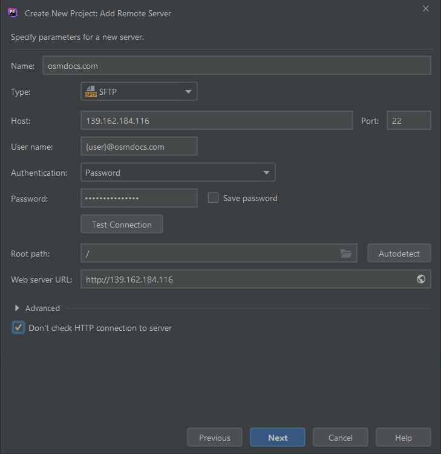

# PhpStorm Or Other JetBrains IDE

PhpStorm and other JetBrains IDE are all built on the top of [IntelliJ IDEA](intellij-idea.html). As such, they all have Markdown editor, Git integration and very similar settings already described in the article on [IntelliJ IDEA](intellij-idea.html).

In addition, these IDE also have built-in solution for synchronizing files with the server. This article describes how to set it up and use it.  

{{ toc }}

## Connecting To OsmDocs

1. Open `File -> New Project From Existing Files`, use `Web server is on remote host, files are accessible via FTP/SFTP/FTPS` and press `Next` button.
2. Enter `Project name` (name of a local directory) and `Project local path` (where it is located) and press `Next` button.
3. Pick `Add new remote server` option and press `Next` button.
4. Enter SFTP connection options as shown below:

    

    Use connection options from `My Books -> [gear icon] -> Edit book contents using SFTP` section in your OsmDocs account.

5. Click `Test Connection` and after test succeeds, then `Next`, `Next` and `Finish`.

## Auto-Syncing Changes

1. Open `File -> Settings` menu.
2. Set `Build, Execution, Deployment -> Deployment -> Options -> Upload changed files automatically to the default server = Always` and press `Apply` and `OK` buttons.

## Working With Files

Just edit files in PhpStorm project, create new ones, delete obsolete files - all the changes will be automatically uploaded to OsmDocs server.

After making changes, open the book in the browser by clicking on a book link in `My Books` page of your OsmDocs account and see how the changes look like.

> **Note**. PhpStorm also tracks changes you make to files outside of PhpStorm. However it only changes for changes and upload changes when you switch back to PhpStorm window.
