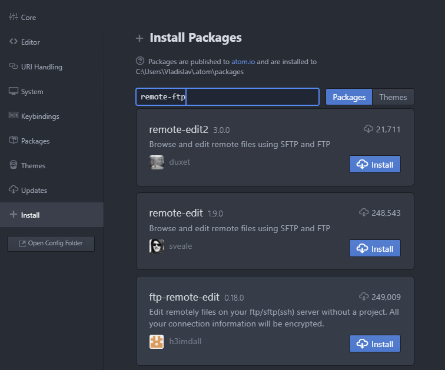
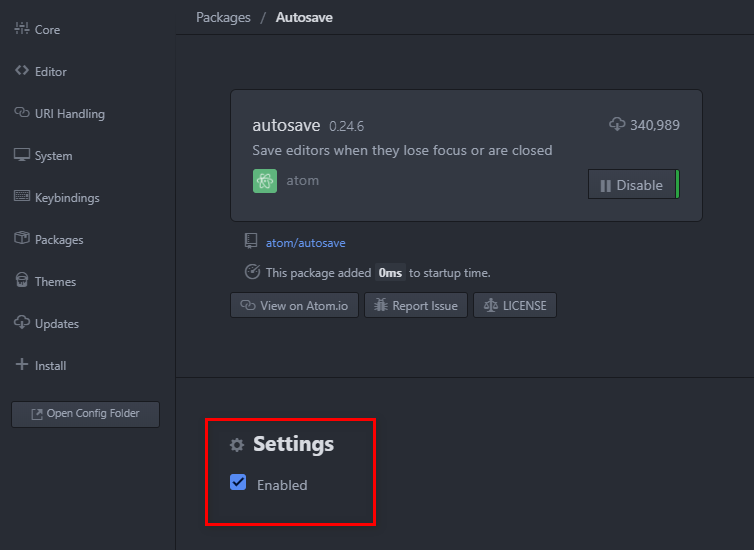

# Atom

After downloading books to your local hard drive, edit book files using Atom. 

Open the directory containing all the books in Atom using `File -> Open Folder` menu. 

Before diving into editing, configure Atom as described in this article:   

{{ toc }}

## Installing Atom Packages For Markdown Editing

1. Open [Atom](https://atom.io/) (install Atom if it is not installed yet) and open its settings via menu `File -> Settings` or by using `Ctrl + Comma` shortcut and click on `Install` tab:

    

2. Enter `language-markdown` package name into `Search packages` text box and press `Enter`. In search result list, locate `language-markdown` package created by `burodepeper` and click its `Install` button.

3. Repeat the same search/install procedure for these packages:

    * `markdown-writer` by `zhuochun`
    * `tool-bar` by `suda`
    * `tool-bar-markdown-writer` by `zhuochun`

These four packages will provide you with rich markdown editing capabilities including live preview and convenient toolbar and keyboard shortcuts for applying visual styles to your text.

## Auto-Saving Files In Atom

After editing a file in Atom you normally have to press `Ctrl + S` to save changes to disk and to upload them to the server. It may lead to certain confusion, so let's enable auto-saving files whenever you switch from Atom to the browser:

1. Open Atom settings via menu `File -> Settings` or by using `Ctrl + Comma` shortcut, click on `Packages` tab and enter `autosave` into `Filter packages` text box:

    

2. Click `Settings` button of the `autosave` package, and then check `Enabled` checkbox in the `Settings` section:

These four packages will provide you with rich markdown editing capabilities including live preview and convenient toolbar and keyboard shortcuts for applying visual styles to your text.
