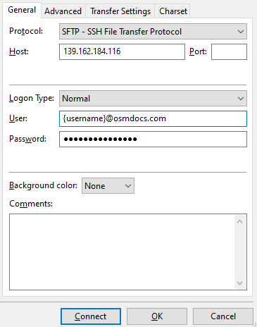

# FileZilla

{{ toc }}

## Connecting To OsmDocs

1. Download [FileZilla](https://filezilla-project.org/download.php?type=client), run the installer and follow the instructions. Open FileZilla after the installation completes.
2. Open `File -> Site Manager` menu, click `New site` button, enter `osmdocs.com` site name and press enter. Then fill in `General` tab as shown below and press `Connect` button:

Use connection options from `My Books -> [gear icon] -> Edit book contents using SFTP` section in your OsmDocs account.

Next time you connect to the book files, open `File -> Site Manager` menu and double-click `osmdocs.com` site name.

## Working With Files

Operation with book files on OsmDocs server are straightforward. Navigate files and use actions from right-click context menu in `Remote site` pane (typically on the right side).

After making changes, open the book in the browser by clicking on a book link in `My Books` page of your OsmDocs account and see how the changes look like.

## Configuration Tips

In `Edit -> Settings` menu:

1. Set `Transfers -> Maximum simultaneous transfers = 5` to make downloading of large directories faster.
2. Set `Interface -> File lists -> Double-click action on files = View / Edit`.
3. Choose `File editing -> Use customer editor` - and pick editor of your choice, for instance, [Notepad++](https://notepad-plus-plus.org/).
4. Explicitly associate `.md` file with your Markdown editor by typing into `File editing -> Filetype associations -> Custom filetype associations` the following or similar text:

        md "c:\Program Files (x86)\MarkdownPad 2\MarkdownPad2.exe"

5. Press `OK` button to save the changes.
