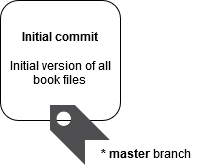
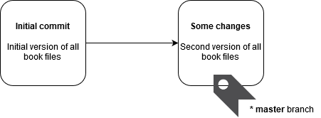
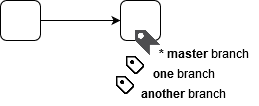
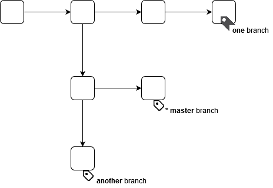
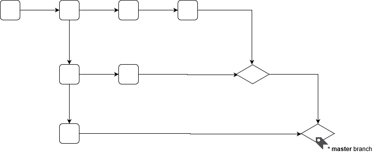

# Git Concepts

{{ toc }}

## Learning Resources

Git is known for its steep learning curve. Keep in mind, however, that lots of people use it every day, and you can do it too!

To get started with Git, check the official learning resources:

* [Pro Git book](https://git-scm.com/book/en/v2) by Scott Chacon and Ben Straub
* [Introductory videos](https://git-scm.com/videos)
* [Curated list of tutorials](https://git-scm.com/doc/ext)
* [Reference documentation](https://git-scm.com/docs)

## Installing Git

1. Download [Git](https://git-scm.com/downloads), run the installer and follow installations steps.
2. Provide Git with information about yourself by running the following commands (replace placeholders with your name and email):

        git config --global user.name "John Doe"
        git config --global user.email johndoe@example.com

## Repository

Git **repository** is a directory storing all the versions of your book.

To get started with Git, download your book files to a local directory (I will refer to it as `{book_dir}`) and create a repository for it by running the following commands in shell:

    cd {book_dir}
    git init

Git repository is created in `{book_dir}/.git` subdirectory:

    {book_dir}
        .git/       # directory containing Git repository 
            ...
        index.md    # book files    
        ...

It is not really important what's exactly inside `.git` directory, it is enough to know that all the book versions are stored there.   

Let's add your book's Git repository into the picture:

## Commits

**Commit** is a single version of all book files stored in Git repository.

Create a initial commit or "the first version" of your book files by running the following commands in shell:

    cd {book_dir}
    git add .
    git commit -am "Initial commit"

After this operation, Git repository contains one commit named "Initial commit" with full copy of the book directory with a `master` branch attached to it (I'll return to [branches](#branches) in a minute):

Do some changes in the book directory - create, edit or delete files. After that, create another commit or "the second version" containing all changed book files  by running the the same commands in shell:

    cd {book_dir}
    git add .
    git commit -am "Some changes"

After this operation, Git repository contains two commits named "Initial commit" and "Some changes" each containing full copy of the book directory. Git knows that "Some changes" goes after "Initial commit". `master` branch attached to the last commit:

As Git stores full copy of all your book files in every commit, you can get every version of your book later if you need it.

By the way, you may use the verb "to commit" instead of "to create a commit".

Git also stores the following information with every commit:

* description of the commit, the **commit message**; enter meaningful commit messages when you commit the changes, see `Initial commit` and `Some changes` in the examples above
* who created the commit
* when commit was created
* unique identifier, the **commit ID**

## Commit History

Run the following command in shell to see all your commits (the command is quite long, make sure to copy it to the end):

    cd {book_dir}
    git log "--pretty=format:%Cred%h%Creset -%C(yellow)%d%Creset %s %Cgreen(%cr) %C(bold blue)<%an>%Creset" --abbrev-commit --graph

You should see the output in color:

    * a68ef93 - (HEAD -> master) `git log` example added (3 minutes ago) <Vladislav Osmianskij>
    * c9df910 - Initial commit (6 minutes ago) <Vladislav Osmianskij>

Output new, changed and deleted files since one commit to another commit, use commit IDs:

    cd {book_dir}
    git diff a68ef93..c9df910 --compact-summary

Display actual changes in files made between the two commits:

    cd {book_dir}
    git diff a68ef93..c9df910

## Branches

**Branch** is a label attached to a specific commit.

After making the first commit, there is a single `master` branch attached to initial commit.

It is also the **current** branch. When you create a commit 2 things happen:

1. New commit is added "after" the commit to which current branch is attached.
2. Current branch is reattached to the newly created commit.

You can say that current branch is `master` by "I'm on `master` branch".

You may create as many branches as you like using:

    cd {book_dir}
    git branch one
    git branch another

All created branches are attached to the same commit as the current branch:

List all branches in your repository with

    cd {book_dir}
    git branch

In the command output, current branch is marked with an asterisk:

      another
    * master
      one

Change current branch (or "switch to `one` branch") using

    cd {book_dir}
    git checkout one

You can also create new branch and switch to it using

    cd {book_dir}
    git checkout -b third

Delete non-current branch when it is not needed anymore using:

    cd {book_dir}
    git branch -d one
    git branch -d another

Use branches to label commits which you currently work on.

For example, two team members may take some commit, make independent changes to it, and create independent commits with their changes. Or independent commits maybe created by the same person.

Such independent work results in non-linear commit history:

By the way, this is where the word "branch" comes from. Branches - the labels attached to commits, are used to create tree-like branches in the commit history.

## Merging

When independent work on two branches is finished, you can create a commit containing merged work from both branches - new files, edits of the existing files and file deletes. Creating the commit containing merged work is called **merging**.

Use the following command to merge branch `some-work` into the current branch:

    cd {book_dir}
    git merge some-work

After this operation, `some-work` branch stays where is was while the current branch is reattached to the new commit containing merged work (the **merge commit**).

`git merge` command tries hard to merge changes, even if they are made to the same file. Sometimes, however, it may need you help to decide. In such cases `git merge` command will fail saying that there are conflicting changes in certain files. You will have to review these files, merge changes manually and commit them. It may sound scary, but actually manual merging only takes few minutes and rarely happens.

Most often you won't use `some-work`  branch after it is merged into current branch, so you can delete it:

    cd {book_dir}
    git branch -d some-work

Below is an example of the commit history after merging branches:

 
